# การทดลองที่ 2 การทำงานเป็นทีมด้วย github #

## 2.การทดลอง ##

2.1 ให้จับกลุ่มสำหรับกลุ่มการทดลองนี้ ตามกลุ่มที่จะทำโปรเจคในวิชา Software Developing Fundamental

  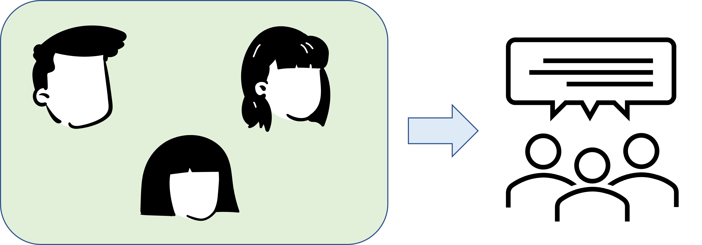 

2.2 ให้นักศึกษาคนหนึ่งทำหน้าที่หัวหน้าทีม ที่เหลือเป็นลูกทีม

   

2.3 ให้แบ่งเนื้อหาในไฟล์นำเสนอโครงงาน ออกเป็นส่วนๆ ตามจำนวนคนในทีม ให้มีปริมาณงานใกล้เคียงกัน

#### ตัวอย่างการแบ่งความรับผิดชอบ 
|ที่|รายละเอียด| ผู้รับผิดชอบ|
|---|---|----|
|1.|สร้าง repo สำหรับโครงงาน| หัวหน้าทีม|
|2.|แบบขออนุมตัหัวข้อโครงงาน| หัวหน้าทีม|
|3.|ภาคเรียนที 1/2565| หัวหน้าทีม|
|4.|ชื่อหัวข้อ (ภาษาไทย)| หัวหน้าทีม|
|5.|ชื่อหัวข้อ (ภาษาอังกฤษ)| หัวหน้าทีม|
|6.|ชื่อนักศึกษา| หัวหน้าทีม|
|7.|ชื่ออาจารย์ที่ปรึกษา| หัวหน้าทีม|
|8.|ปัญหาที่ต้องการศึกษาและ/หรือวิจัย| หัวหน้าทีม|
|9.|หลักการเดิมหรือแนวทางเดิมที่ใช้ในการแก้ปัญหา| สมาชิก 1|
|10.|ขีดความสามารถของโครงงาน | สมาชิก 1|
|11.|ประโยชน์ที่คาดว่าจะได้รับ | สมาชิก 1|
|12.|วัตถุประสงค์ | สมาชิก 1|
|13.|แผนผังการทํางาน/หลักการทํางาน/ผังงานของโปรแกรม | สมาชิก 2|
|14.|แผนการทําโครงงาน| สมาชิก 2|
|15.|ทะเบยีนประวัตินักศึกษาผู้จัดทำโครงงาน สมาชิก 2|

2.4 ให้หัวหน้าทีมสร้าง repo ใน account ของตนเอง

  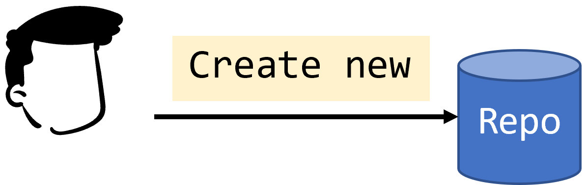 

__ตัวอย่าง__

  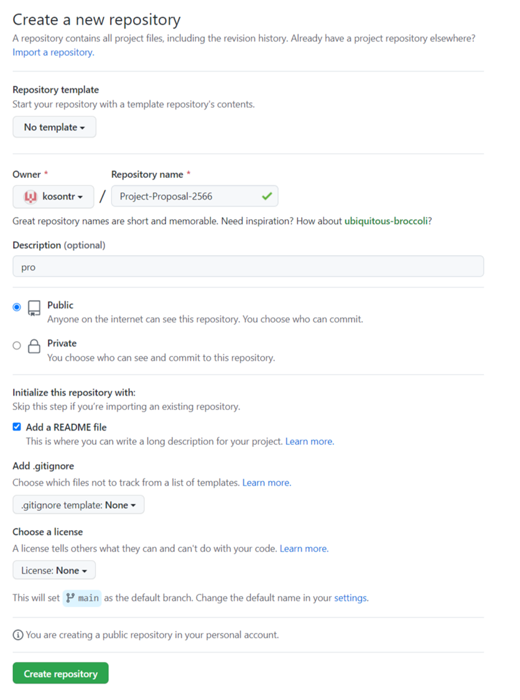 

 
2.5 ให้ลูกทีม fork repo นั้นจากหัวหน้าทีม

  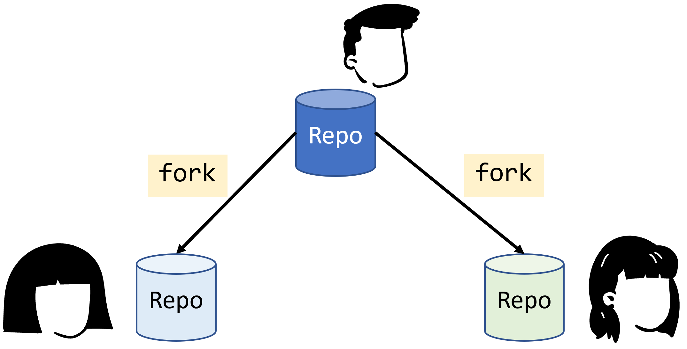 

__ตัวอย่าง__

  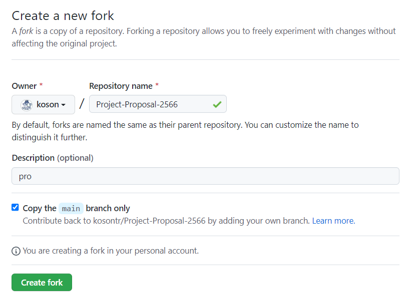 

2.6 ขั้นตอนสำคัญที่จะช่วยให้ repo หลักไม่พังคือการสร้าง branch ใหม่ใน repo ที่ fork มา ให้สมาชิกทุกคน (รวมทั้งหัวหน้าทีม) สร้าง branch ขึ้นใน repo ของตัวเอง

ตัวอย่าง
|ที่|ผู้รับผิดชอบ| ชื่อ branch |
|---|---|----|
|1.|หัวหน้าทีม|`Dev-by-Leader`|
|2.|สมาชิก 1|`Dev-by-Member1`|
|3.|สมาชิก 2|`Dev-by-Member2`|

  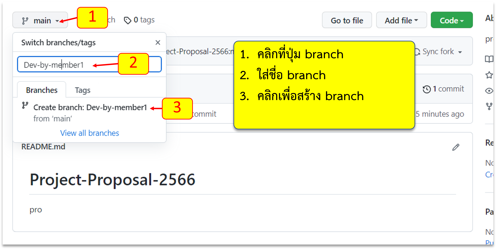 

  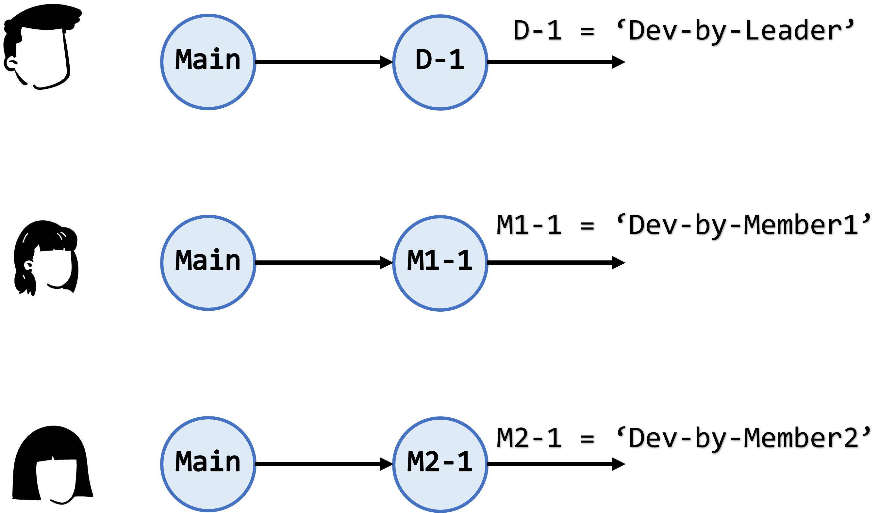 

2.7 ให้นักศึกษาที่ได้รับแบ่งงาน สร้างไฟล์ย่อยๆ สำหรับแต่ละคน โดยให้มีนามสกุลเป็น .md (สร้างใน branch ใหม่ที่สร้างในข้อ 2.6)
    
ตัวอย่าง
|ที่|ผู้รับผิดชอบ| ชื่อ file|
|---|---|----|
|1.|หัวหน้าทีม|`Project-part-1.md`|
|2.|สมาชิก 1|`Project-part-2.md`|
|3.|สมาชิก 2|`Project-part-3.md`|

  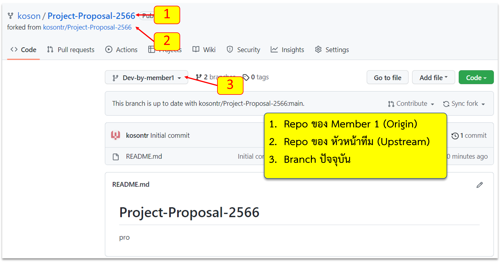 

2.7 ให้เพิ่มเนื้อหาตามที่รับผิดชอบในแต่ละหัวข้อลงไปในแต่ละไฟล์ (ทำให้แน่ใจว่าอยู่ใน branch Dev... ที่สร้างในข้อ 2.6)

  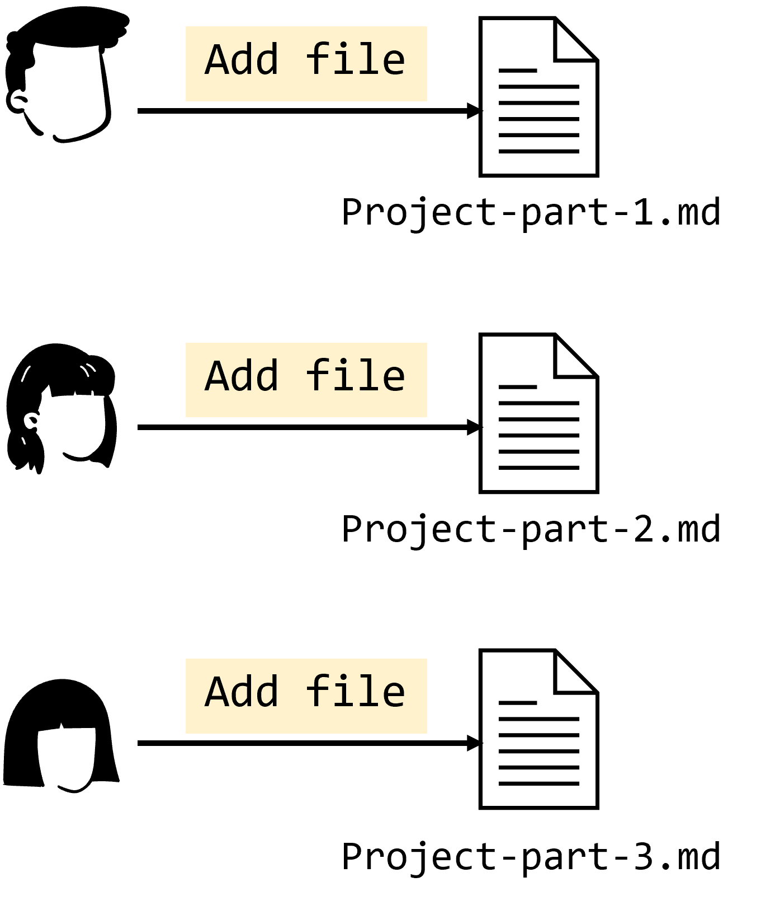 

  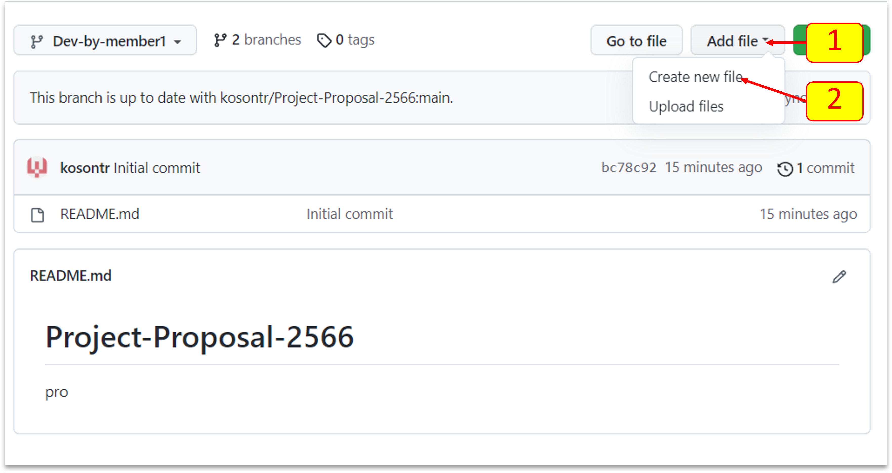 

2.8 เมื่อเพิ่มเนื้อหาในแต่ละหัวข้อเสร็จ ให้ทำการ commit หัวข้อละ 1 ครั้ง

  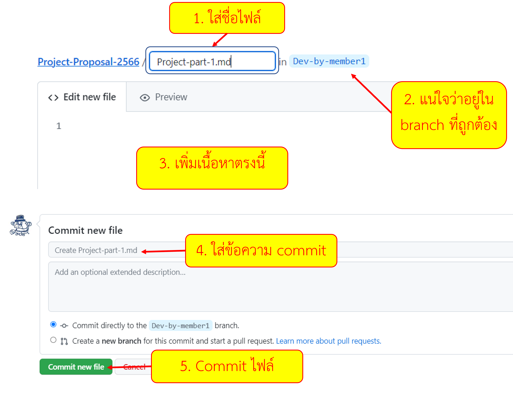 

git จะฟ้องว่า branch ของเรามีความก้าวหน้ากว่า upstream repo อยู่กี่ commit

  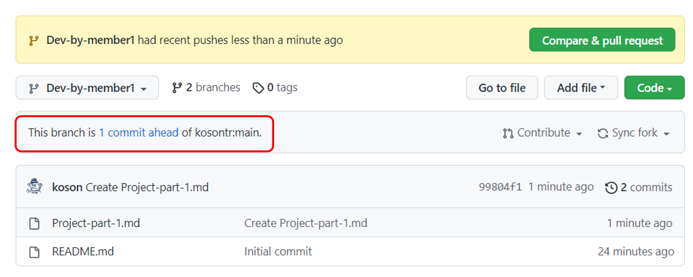 

2.9 เมื่อทำงานได้ครบตามภาระที่ได้รับมอบหมาย ให้ทำการ pull request ไปที่ repo ของหัวหน้าทีม (Upstream repo) 

ถ้าเราเพิ่งจะ commit อาจจะมีปุ่ม `Compare & pull request` ปรากฏขึ้นมา สามารถใช้ปุ่มนี้ได้เลย

  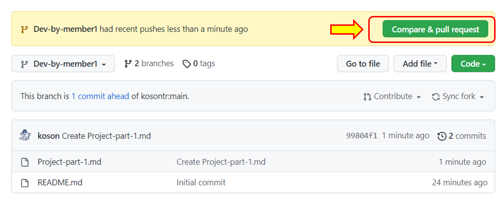 

หรือไม่ก็สามารถกดปุ่ม Contribute เพื่อแบ่งปันงานที่เราทำได้ตามขั้นตอนต่อไปนี้

  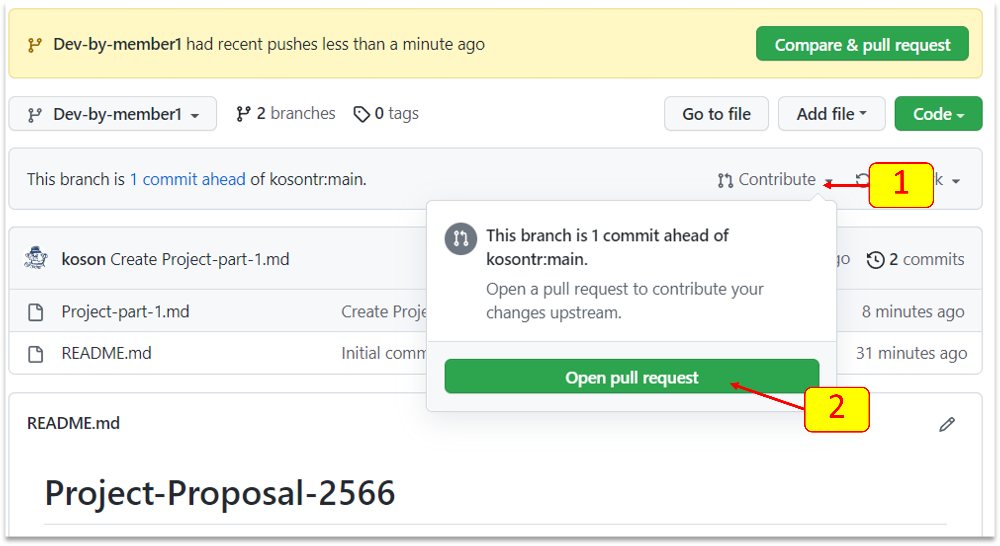 

[1] คลิกปุ่ม `Contribute`

[2] คลิกปุ่ม `Open pull request`

เมื่อคลิกปุ่ม `Open pull request` ก็จะเปลี่ยนมาที่หน้า Comparing changes ที่จะทำการตรวจสอบเบื้องต้นว่าเราสามารถทำ pull request ได้ทันทีหรือไม่ 
 

  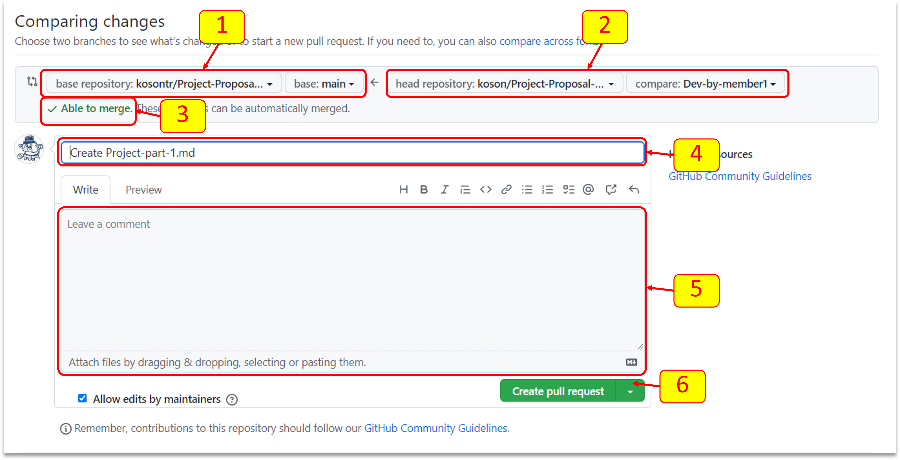 

[1] แสดง branch บน upstream ที่จะ pull request  

[2] แสดง branch บน origin ที่จะ pull request  

[3] ข้อความบอกว่าสามารถทำการ pull request ได้หรือว่ามีข้อขัดแย้งใดๆ หรือไม่  

[4] ข้อความสั้นๆ ที่อธิบายเหตุผลในการทำ pull request  

[5] ข้อความที่จะสิ่อสารไปยังเข้าของ upstream repo ที่จะทำ pull request  

[6] คลิกเพื่อทำ  pull request  

ในบางกรณีอาจจะมีการขัดแย้งในการแก้ไขไฟล์ เช่นมี contributes หลายคนได้แก้ไข source code ในบรรทัดเดียวกันแล้ว commit มาพร้อมๆ กันในคราวเดียว ซึ่งระบบจะไม่ยอมให้ทำการ merge จนกว่าจะได้ทำการแก้ไขข้อขัดแย้งนั้นเสียก่อน

  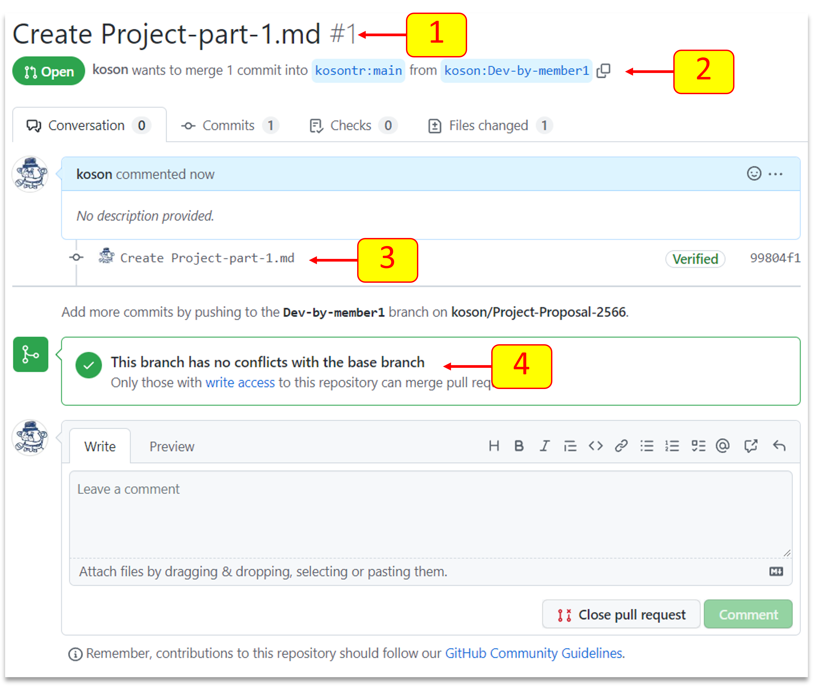 

[1] แสดง หมายเลข pull request

[2] แสดงข้อความบอกว่า user ใดต้องการรวม branch ของ upstream repo ด้วย branch ใดบน origin repo  

[3] ข้อความสั้นๆ ที่อธิบายเหตุผลในการทำ pull request

[4] ระบบแจ้งให้ผู้ทำ PR ทราบว่าไม่มีข้อขัดแย้ง สามารถรวมงานเข้ากับ upstream repo ได้ ซึ่งการจะได้รวมหรือไม่นั้นก็ขึ้นอยู่กับเจ้าของ upstream repo (ซึ่งก็คือหัวหน้าทีม)

2.11 ให้หัวหน้าทีมตรวจสอบและทำการ merge pull request ให้เรียบร้อย

หัวหน้าทีมจะเห็นว่ามีการทำ pull request เข้ามาและมีจำนวนเท่าใด

  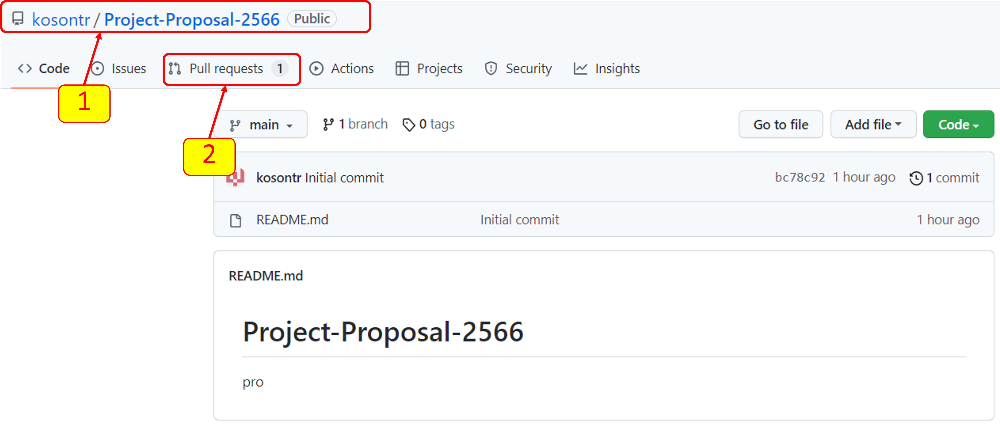 

[1] repo ของหัวหน้าทีม 

[2] คลิกที่ Pull requests

  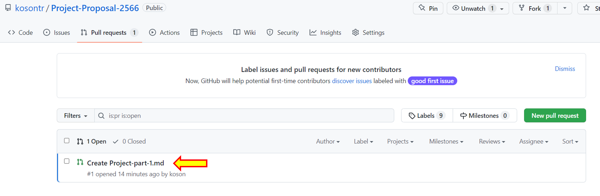 

คลิกเข้าไปดู pull request 

  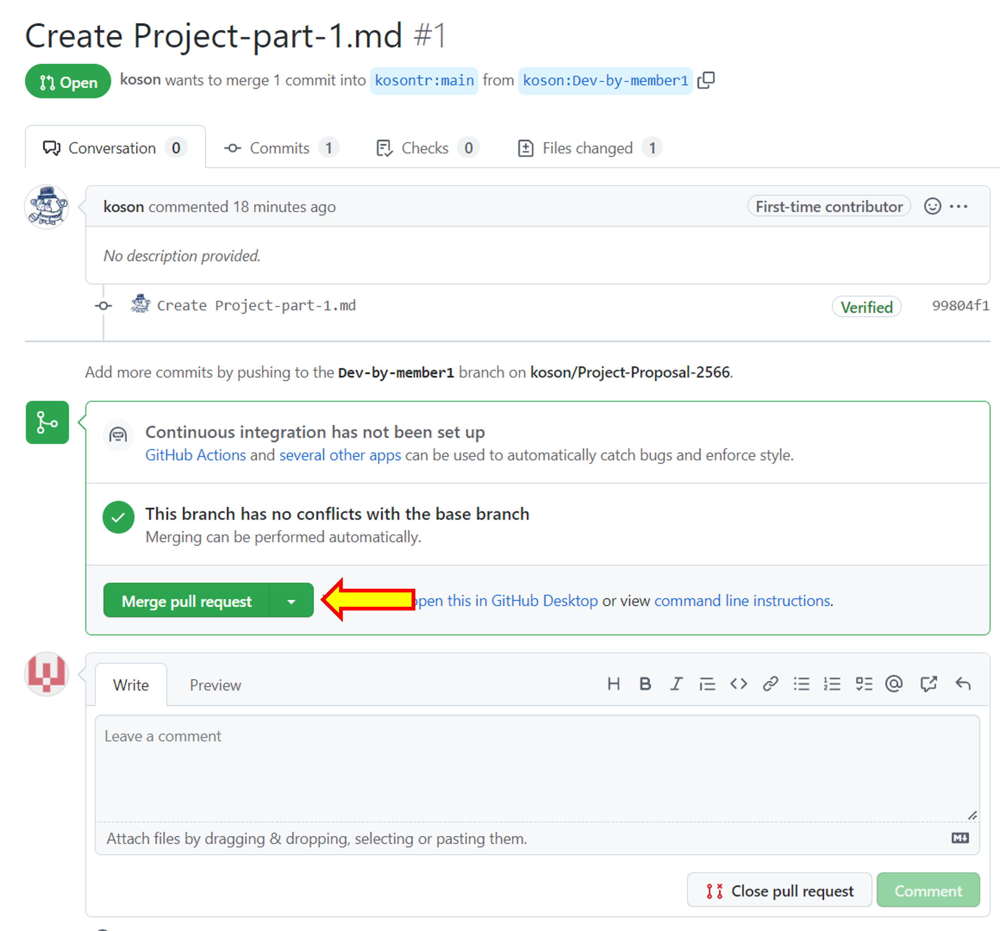 

ตอบรับการ pull request (merge งานเข้ากับ upstream repo) 
กด confirm เพื่อยืนยันการ merge

  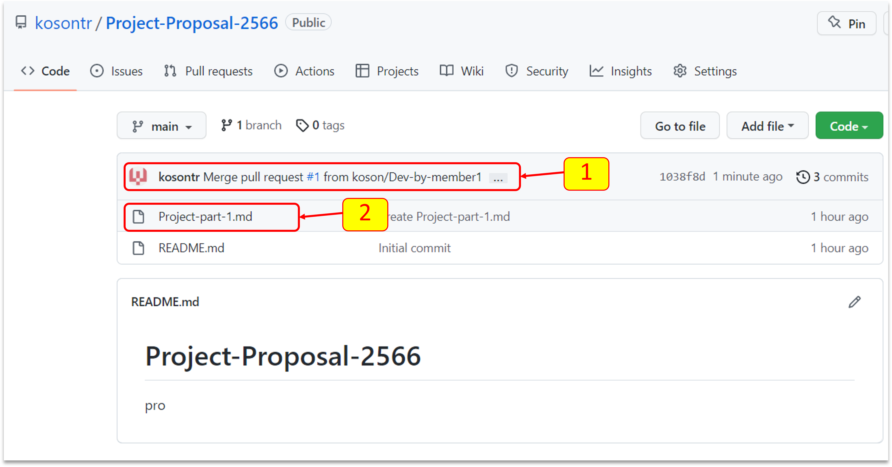 

[1] ข้อความแจ้งว่ามีการ merge pull request 

[2] ไฟล์ที่ได้รับจากการ pull request ของ Member 1

เมื่อทำ pull request เรียบร้อยแล้วจะมีข้อความแจ้งให้ทราบ รวมถึงจะมีการปิด pull rewuest ให้โดยอัตโนมัติ
 

  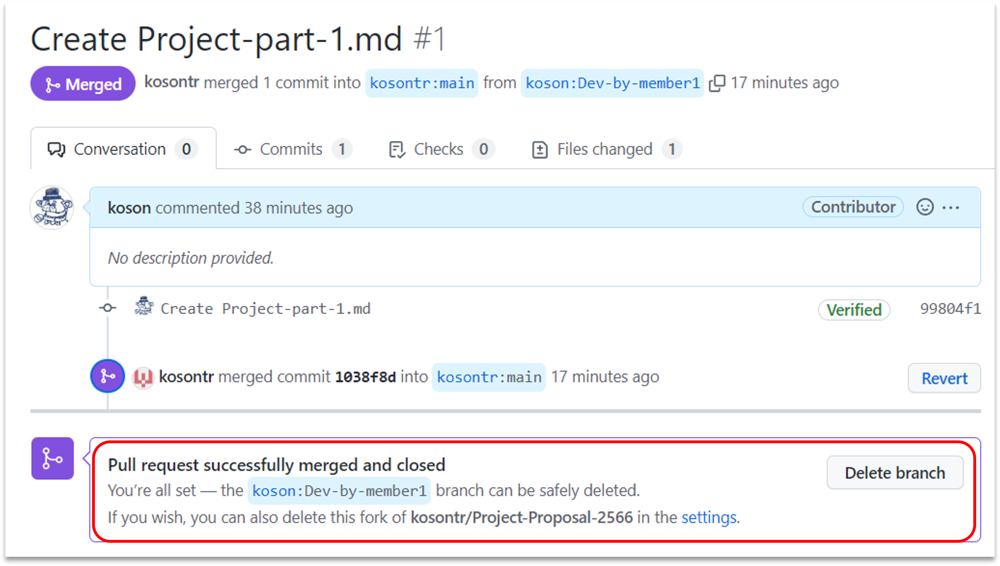 

ข้อดีของการพัฒนางานเป็นทีม
1. Member ทุกคนสามารถทำการ dev ไปพร้อมๆ กัน
2. Member สามารถสร้างงานใน branch ที่ไม่กระทบต่องานปัจจุบัน

## [3.การส่งงาน (คลิก)](2-report.md) ##
