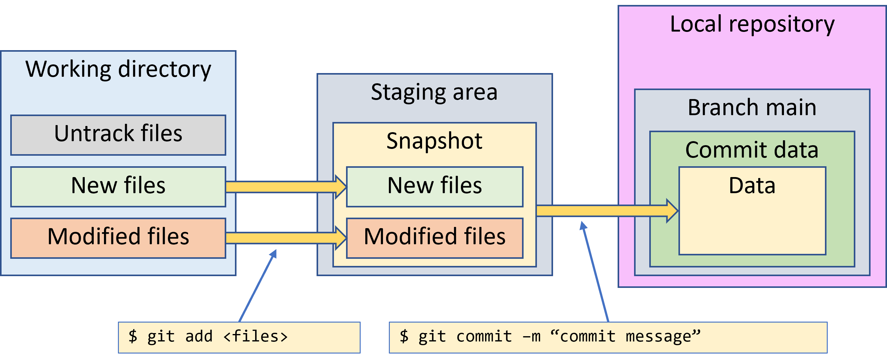
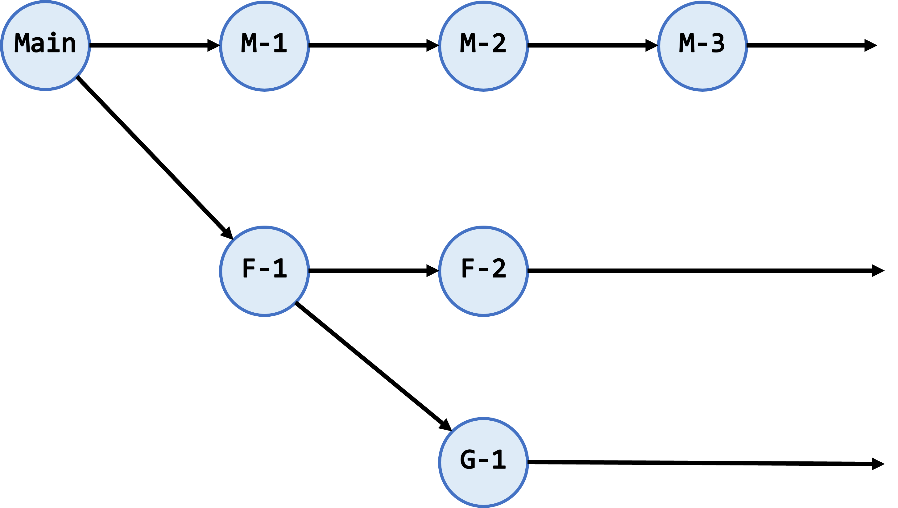
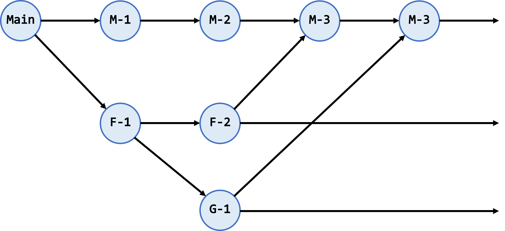

# การทดลองที่ 2 การทำงานเป็นทีมด้วย github #

## 1.กล่าวนำ ##

### 1.1 ทบทวนความรู้จากครั้งที่แล้ว ###

ในระบบการทำงานของ git ที่เครื่องของนักพัฒนานั้น จะมีพื้นที่เก็บไฟล์ 3 ส่วนด้วยกันคือ `Working directory`, `staging area` และ `Local repository`

ไฟล์ต่างๆ ที่เป็นโปรเจคของเรา จะอยู่ใน working directory สามารถเรียกดูได้โดยการใช้คำสั่ง ls, dir หรือเรียกดูได้โดยการใช้ file browser

ส่วนของ Local repository จะอยู่ใน directory ที่ชื่อว่า .git และถูกซ่อนไว้จากการเรียกดูไฟล์โดย วิธีการปกติ แต่อาจเรียกดูได้จากคำสั่ง ls -al หรือการแก้ไข properties ให้ file browser สามารถมองเห็นไฟล์ที่ซ่อนไว้ เนื้อหาในส่วนนี้ git จะมีวิธีการบริหารจัดการในลักษณะฐานข้อมูล และไม่สามารถใช้วิธีการปกติในการเปิดอ่านไฟล์ได้

ส่วนที่เหลืออีกอย่างหนึ่งคือ staging เป็นส่วนที่ระบบ git ใช้เปรียบเทียบความแตกต่าง ระหว่างไฟล์ใน working dorectory กับข้อมูลที่เก็บใน database เพื่อติดตามการเปลี่ยนแปลงของไฟล์ทั้งหมดที่ถูก track เราสามารถตรวจสอบสถานะได้จากการใช้คำสั่ง git status

   

 <b> รูปที่ 2-1 </b> การทำงานในส่วนต่างๆ ของ git บนเครื่อง local computer

### __1.2 สิ่งที่ควรรู้จักก่อนทำงานเป็นทีมบน git__

__`git branch`__

Git branch เป็นคำสั่งที่ทำหน้าที่ แสดง สร้าง หรือลบ branch ออกจาก repository โดยมีคำสั่งย่อยๆ ดังต่อไปนี้

| รูปแบบคำสั่ง | การทำงาน|
|------------|---------|
|git branch | แสดง branch ทั้งหมด|
|git branch `<branch>` |สร้าง branch ใหม่ที่มีชื่อว่า  `<branch>`, โดยอ้างอิงจุดในอดีตตาม branch ปัจจุบัน|
|git branch `<branch> <start-point>` |สร้าง branch ใหม่ที่มีชื่อว่า  `<branch>`  โดยอ้างอิงจุดเริ่มต้นจาก `<start-point>` ที่ระบุในคำสั่ง ซึ่งอาจจะเป็น branch name หรือ tag name.|
|git branch -d `<branch>` |ลบ branch ที่ชื่อว่า `<branch>`|
|git branch -D `<branch>` |ลบ branch ที่ชื่อว่า  `<branch>` โดยไม่สนใจสถานะการ merged|
|git checkout `<branch>` |ย้าย branch มาอยู่ที่ `<branch>` พร้อมทั้งเปลี่ยนแปลงทุกอย่างที่อยู่ใน working directory ให้เป็นไปตาม `<branch>` ใน repository|
|git checkout -b `<new> <start-point>` | สร้าง branch ใหม่ที่ชื่อว่า `<new>` โดยอ้างอิงจุดเริ่มต้นเป็น `<start-point>` จากนั้นก็ทำการ checkout|

__`git merge`__

___Git merge___ เป็นคำสั่งที่ใช้รวมประวัติการพัฒนาตั้งแต่สองจุดขึ้นไปเข้าด้วยกัน เนื่องจากโดยปกติแล้ว การพัฒนาโครงการต่างๆ บน git มักจะถูก commit ตามเวลา ดังนั้น ในการที่เราจะพัฒนาโครงการ ไม่ว่าจะเป็นการเพิ่ม feature ต่างๆ หรือการแก้ไขบัก (bug fix) ก็ไม่ควรที่จะไปรบกวน source code บนเส้นทางหลักของการพัฒนาโปรแกรม เนื่องจากในขณะที่เรายังพัฒนา feature หรือแก้ไขบักไม่เสร็จ อาจจะมีใครมา clone โครงการที่วางบนเส้นทางหลัก ดังนั้น เราควรสร้าง branch สำหรับพัฒนาหรือเพิ่ม fetures ต่างๆ ขึ้นมา จากนั้นเมื่อพัฒนาหรือแก้ไขบักสำเร็จแล้ว จึงค่อยนำ code ใน branch กลับไปรวม (merge) เข้ากับโปรแกรมในเส้นทางหลัก

## 1.3 แนวคิดในการทำ branch และ merge ##

การสร้าง branch ขึ้นมาเพื่อพัฒนา feature ใหม่ๆ (เช่น feature-1 ) จะช่วยให้เราสามารถพัฒนาได้อย่างอิสระ โดยที่ไม่ต้องกังวลว่าการ commit code จะไปรบกวนการทำงานของ code ใน main จากรูปที่ 2 จะพบว่าเราสามารถพัฒนา main  (M-1, M-2, M-3) ควบคู่ไปกับการพัฒนา feature (F-1, F-2)  หรือ  G-1 ได้

   

 <b> รูปที่ 2-2 </b> การพัฒนาโดยการแยก branch ออกมา  

เมื่อใดที่ทำการพัฒนา feature-1 เสร็จเรียบร้อยแล้ว เราสามารถนำกลับไปรวมกับ main ได้ทุกเวลา ดังรูปที่ 2-3

   

 <b> รูปที่ 2-3 </b> การรวม feature เข้ากับ main

จากรูปที่ 2-3 พบว่าการ merge เกิดขึ้นที่  commit M-3 โดยที่มี commit M-2 เป็น parrent แรก และ F-2 เป็น parrent ที่สอง  ในการ merge จะต้องมั่นใจว่า branch ปัจจุบันเป็น branch ที่เราต้องการ merge เอา branch อื่นเข้ามา (Branch child)
ในการทำงานร่วมกันบน repository มีสถานการณ์ (scenario) ที่สามารถเกิดขึ้นได้มากมาย มีวิธีการแก้ไข สถานการณ์ต่างๆ เหล่านั้น ซึ่งจะได้เรียนรู้ในการทดลองลำดับต่อไป     

## [2.การทดลอง (คลิก)](1-team-work-repo.md) ##
